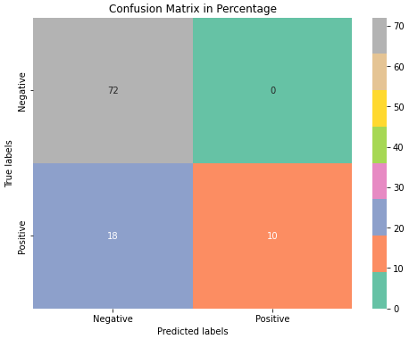

## Team Members

- **Haoyu Fu**  
  Email: [h6fu@ucsd.edu](mailto:h6fu@ucsd.edu)
- **Yixuan Zhang**  
  Email: [yiz119@ucsd.edu](mailto:yiz119@ucsd.edu)

## Mentor

- **Haojian Jin**  
  Email: [haojian@ucsd.edu](mailto:haojian@ucsd.edu)

# Background

**Report Link**: [Access the full report here](https://github.com/HaoyuFu2/artifact-directory-template/blob/main/report.pdf)

- **Traditional Polling**: Traditional methods include surveying, phone calling, and interviewing. These methods are time-consuming and require significant human resources.

- **Innovative Approach**: Our project seeks to explore novel methodologies for determining people's political affiliations using machine learning and large language models. This approach aims to potentially reduce the costs and resources needed for polling.

# Data

- **Data Source**: The data for this study are sourced from Kaggle and include tweets tagged with #JoeBiden and #DonaldTrump. These datasets are used to assess and distinguish user sentiments and preferences towards Joe Biden and Donald Trump.

- **Pre-Processing**: The raw data contains many features, including the text content of the tweets, the number of likes, the time posted, the user id of the authors, etc. We only keep a few features we are interested in, which are the user id, time posted, and the text content. Then we put significant efforts to clean the data, including removing URL links, mentions(@), hashtags(\#), and emoji from tweets to enhance clarity and accuracy. 

- **Dataset Details**: The cleaned data consists of two main components: 'cleaned tweets' and 'userid'. 'cleaned tweets' dataset comprises 556,334 rows and 3 columns, containing user IDs and tweet texts that have been cleansed of unnecessary elements such as URLs, @mentions, and hashtags. The 'userid' feature refers to the unique identification number of a Twitter user, so we can group the tweets by authors.

# Methods

### Text Processing

The text content is the tweet component that we are most interested in. We treat the training data and new data differently:

- **Training Data**: We manually labeled 100 users on whether they support Trump or Biden. Then we processed their tweets with sentiment analysis that reflect sentiment polarity, strong negation, excessive punctuation, and topic diversity. With these extracted features, we clustered the users into a few groups, and apply the cluster to the whole dataset, such that we have enriched features which we can perform further analysis of embedding and dense layers.

- **New Data**: The new data were used to make predictions, so we can just perform sentiment analysis and skip the clustering procedure. Similar to the training data, we process the enriched features with embedding and dense layers.

### Layers:
- With the text data processed, we fed the embeddings to **dense layers**, along with the user ID and the post times. Combined with Large Language Models, we can generate responses that simulates a user's thoughts given a political topic.

- **Dense layer** is a type of neural network tool, and our purpose of using **dense layers** is to capture the latent patterns within the embeddings.

# Evaluation
- **Checking Ground Truth**: We manually labelled about 100 users, and compare this with the model results to evaluate the accuracies.

# References
Junsol Kim and Byungkyu Lee. Ai-augmented surveys: Leveraging large language models and surveys for opinion prediction, 2023.
